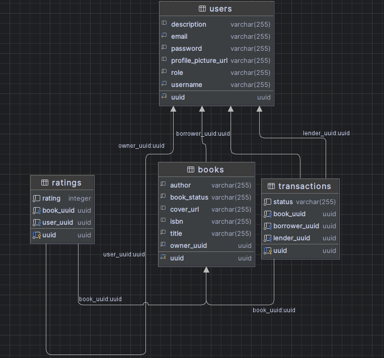

## Project:

- Book Social Network
  Users can lend and borrow books from others in the community. Each book would have a rental history, and users could
  rate the books.

## Database Schema:

## Tables Overview

### 1. **Users Table**

The `users` table stores information about users of the application.

| Field                 | Type           | Description                                                  |
|-----------------------|----------------|--------------------------------------------------------------|
| `uuid`                | `uuid`         | Primary key, unique identifier for each user.                |
| `description`         | `varchar(255)` | Optional description for the user.                           |
| `email`               | `varchar(255)` | User's email address. Must be unique.                        |
| `password`            | `varchar(255)` | User's password.                                             |
| `profile_picture_url` | `varchar(255)` | URL of the user's profile picture.                           |
| `role`                | `varchar(255)` | The user's role. Possible values: `ADMIN`, `USER`, `BANNED`. |
| `username`            | `varchar(255)` | User's unique username.                                      |

### 2. **Books Table**

The `books` table stores information about books available in the system.

| Field         | Type           | Description                                                              |
|---------------|----------------|--------------------------------------------------------------------------|
| `uuid`        | `uuid`         | Primary key, unique identifier for each book.                            |
| `author`      | `varchar(255)` | Author of the book.                                                      |
| `book_status` | `varchar(255)` | The status of the book. Possible values: `AVAILABLE`, `BORROWED`.        |
| `cover_url`   | `varchar(255)` | URL of the book's cover image.                                           |
| `isbn`        | `varchar(255)` | ISBN of the book.                                                        |
| `title`       | `varchar(255)` | Title of the book.                                                       |
| `owner_uuid`  | `uuid`         | Foreign key to the `users` table. Represents the user who owns the book. |

### 3. **Ratings Table**

The `ratings` table stores ratings given by users to books.

| Field       | Type      | Description                                                                |
|-------------|-----------|----------------------------------------------------------------------------|
| `uuid`      | `uuid`    | Primary key, unique identifier for each rating.                            |
| `rating`    | `integer` | The rating given to the book (e.g., 1-5).                                  |
| `book_uuid` | `uuid`    | Foreign key to the `books` table. References the book being rated.         |
| `user_uuid` | `uuid`    | Foreign key to the `users` table. Represents the user who gave the rating. |

### 4. **Transactions Table**

The `transactions` table tracks book borrow and return transactions between users.

| Field           | Type           | Description                                                                        |
|-----------------|----------------|------------------------------------------------------------------------------------|
| `uuid`          | `uuid`         | Primary key, unique identifier for each transaction.                               |
| `status`        | `varchar(255)` | The status of the transaction. Possible values: `ONGOING`, `COMPLETED`.            |
| `book_uuid`     | `uuid`         | Foreign key to the `books` table. Represents the book involved in the transaction. |
| `borrower_uuid` | `uuid`         | Foreign key to the `users` table. Represents the user borrowing the book.          |
| `lender_uuid`   | `uuid`         | Foreign key to the `users` table. Represents the user lending the book.            |

## Relationships

1. **Users → Books**: A user can own multiple books. This is represented by the `owner_uuid` foreign key in the `books`
   table, which links to the `uuid` field in the `users` table.

2. **Books → Ratings**: A book can have multiple ratings from different users. The `ratings` table holds a foreign key (
   `book_uuid`) that references the `uuid` field in the `books` table.

3. **Users → Ratings**: A user can give multiple ratings to different books. The `ratings` table holds a foreign key (
   `user_uuid`) that references the `uuid` field in the `users` table.

4. **Users → Transactions**: A user can be both the borrower and the lender of multiple books. The `transactions` table
   holds two foreign keys:

- `borrower_uuid` references the `uuid` field in the `users` table.
- `lender_uuid` references the `uuid` field in the `users` table.

5. **Books → Transactions**: A book can be involved in multiple transactions. The `transactions` table holds a foreign
   key (`book_uuid`) that references the `uuid` field in the `books` table.

### Query:

- **Find all books with rating above 4.0**.

### Business Logic Operation:

- **Borrowing a Book**: The described operation is well-defined and involves multiple steps:
    1. **Check Book Availability**: Ensuring the book can be borrowed.
    2. **Create Transaction**: Recording the transaction details.
    3. **Update Book Status**: Changing the status of the book to `BORROWED`.
    4. **Update User’s Borrowed Books**: Incrementing the count of books borrowed by the user.